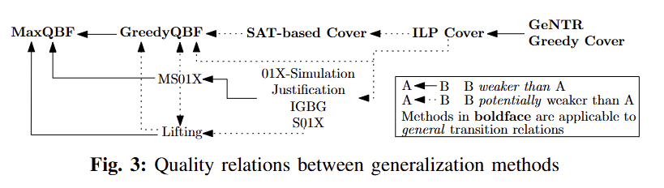
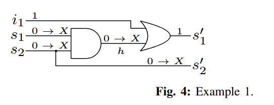

# Everything You Always Wanted to Know About Generalization of Proof Obligations in PDR

## 论文信息

- 发表会议/期刊：IEEE Transactions on Computer-Aided Design of Integrated Circuits and Systems（TCAD,A刊）

- 标题: *Everything You Always Wanted to Know About Generalization of Proof Obligations in PDR*
- 作者: Tobias Seufert, Felix Winterer, Christoph Scholl, Karsten Scheibler, Tobias Paxian, Bernd Becker
- 时间: 2022

## 摘要
本文重新探讨比特级属性驱动可达性（PDR）算法中证明义务的泛化问题。我们开展了一项系统性研究，主要完成以下工作：（1）确定该问题的计算复杂度；（2）全面分析现有方法的局限性；（3）提出此前未在 PDR 场景中使用过的证明义务泛化方法；（4）从理论层面对比不同方法的泛化能力与优势；（5）在硬件模型检验与人工智能规划领域的多种标准测试集上，对各类方法进行了充分的实验评估。

## 主要贡献
我们分别针对普通电路、逆序电路、带不变量约束的电路以及一般迁移关系，讨论了精确型与近似型证明义务泛化技术。本文的主要贡献如下：

1.证明了PDR 中的证明义务（PO）泛化问题在一般情况下是 `Π₂ᴾ- 完全的`。这意味着，任何非近似的精确求解方案，其复杂度均与 `2-QBF` 问题等价。

2.研究了时序电路（即迁移函数） 中尚未在 PDR 领域使用的泛化技术，并深入分析了现有经典方法无法适用于一般迁移关系的根本原因。

3.讨论了适用于带不变量约束电路的泛化方法，并给出可让所有已知电路泛化技术正确应用的等价变换方案。

4.提出面向一般迁移关系的泛化方法，包括近似方法，以及基于 `QBF` 与 `MaxQBF` 求解的精确方法。

5.系统分析各类方法正确执行所需的迁移关系性质，为证明义务泛化方法的使用者提供场景化应用指南。

6.从理论层面，全面对比了不同方法的泛化能力强弱。

7.从工程实践层面，对各类方法及部分组合方案进行充分实验评估。实验采用带 / 不带不变量约束的硬件模型检验竞赛（HWMCC）基准集[15–17]，以及国际规划竞赛（IPC）的人工智能规划基准集。结果表明：新方法优于现有成熟泛化方案；不同方法优势互补，通过组合使用可进一步提升效果；即便计算开销最高的方法，也能凭借更强的泛化能力，实现整体运行时间的优化。

此外，本文还利用精确方法分析了各类近似方法的潜在优化空间。

## 一句话总结

这篇论文系统研究了 PDR/IC3 中 **proof obligation generalization** 的问题。它首先说明这个问题本质上是一个 `2-QBF` 级别的高复杂度问题，然后全面梳理并比较了已有方法和新方法，覆盖从电路型 transition function 到一般 transition relation、从标准 PDR 到 Reverse PDR、从无约束电路到带 invariant constraints 的场景，最终给出一套“什么方法在什么条件下才正确、才有效”的完整地图。

## 为什么要做

在 PDR 中，当 SAT 求解器发现某个 proof obligation `d` 在 `R_{k-1}` 中有前驱时，通常先得到的是一个**具体状态** `m`。如果直接把这个具体状态作为新的 proof obligation 递归处理，会带来几个问题：

- 处理对象太具体，只是在按单个状态搜索
- 会产生更多 proof obligations
- 学到的 blocking clauses 往往更弱
- frame 强化更慢，整体收敛更慢

因此，PDR 通常会在拿到具体状态 `m` 后，先把它泛化成一个更短的 cube `c`，再把 `c` 当作新的 proof obligation。这就是 **proof obligation generalization**。

论文认为，这一步对 PDR 的性能影响极大，但过去存在几个明显缺口：

- 很多方法只在“transition relation 来自电路函数”时适用
- 一旦 transition relation 更一般，就不知道哪些方法还能用
- 对 invariant constraints、Reverse PDR 等场景缺少系统分析
- 不同 generalization 方法之间的理论强弱、适用前提、实验效果没有被统一比较

所以这篇论文的目标不是只提一个小优化，而是要把 “PO generalization 到底是什么、为什么难、已有方法什么时候成立、还能怎么做” 这件事彻底讲清楚。

## PDR 中它解决的具体问题

在 PDR 中，递归阻塞一个 proof obligation `d` 时，会检查：

`SAT?[¬d ∧ R_{k-1} ∧ T ∧ d']`

如果 SAT，说明找到了一个前驱状态 `m`。  
这时需要做的就是：

- 从完整 minterm `m` 中删掉一些字面量
- 得到更短的 cube `c`
- 但仍保证 `c` 中的每个状态都还是 `d` 的前驱

也就是说，generalization 的目标不是随便变短，而是：

- **删掉尽可能多的 present-state literals**
- **同时保持“仍然是合法 proof obligation”**

## 论文先做了什么：形式化问题并分析复杂度

论文把这个问题形式化成 **PO Generalization Problem (POGP)**：

- 输入是 transition relation `T`
- 一个候选当前状态 cube `c`
- 一个目标后继 cube `d'`
- 问题是：`c` 是否仍然保证所有被它覆盖的当前状态都能经由某个输入转移到 `d'`

这个形式化很重要，因为它把工程中的“删字面量”问题变成了一个严肃的逻辑判定问题。

论文的关键理论结论是：

- **POGP 是 `Π_2^P-complete`**

这表示：

- 精确 generalization 本质上和一个 `2-QBF` 问题一样难
- 想要求出真正最优的 generalized cube，不是简单 SAT 技巧就能轻松解决的
- 过去大量工程方法采用近似手段，不只是 heuristic 偏好，而是问题本身就很难

这一步给整篇论文定了基调：  
**PO generalization 不是一个简单局部优化，而是一个天然高复杂度的问题。**

## 论文做了哪些事情

论文的工作大致分成四部分：

1. 分析 PO generalization 的复杂度
2. 系统研究电路型 transition function 上的近似 generalization 方法
3. 扩展到一般 transition relation，并引入 QBF / MaxQBF 等方法
4. 对各种方法做理论比较和大规模实验比较

## 一、对已有标准方法做系统分析

论文重新梳理了 PDR 中常见的几类 PO generalization 方法：

- `01X-simulation`
- `lifting`
- `justification`

并不是简单复述，而是分析这些方法正确性依赖的 transition relation 性质。

### 1. 01X-simulation

这是 PDR 中很经典的方法。做法是：

- 从一个完整状态 `m` 出发
- 尝试把某些 present-state bit 设为 `X`
- 用三值逻辑在电路上做仿真
- 如果 `X` 没有传播到目标 next-state cube `d'` 的相关输出，就说明这个 bit 不是必须的，可以删除

优点：

- 快
- 实现直接
- 非常适合电路结构

缺点：

- 本质上依赖电路结构和三值仿真
- 是贪心近似，不一定能得到最优 generalization
- 01X 逻辑本身有不精确性

### 2. Justification

这个方法和 01X-simulation 很接近，不过思路更像：

- 不是看“X 会不会传播坏”
- 而是看“哪些 present-state literals 对推出 `d'` 真正必要”

它通过在电路中构造 justification paths，保留那些真正支撑 `d'` 的状态变量赋值。

论文指出：

- justification 得到的结果本质上也是 01X-simulatable 的
- 所以它在 generalization 强度上与 01X 系方法关系很近

### 3. Lifting

lifting 是另一类非常有代表性的方法。

思路是：

- SAT 查询得到完整赋值 `m` 和输入 `i`
- 如果 transition relation `T` 是电路函数，那么 `m ∧ i` 会决定唯一后继
- 因而查询 `SAT?[m ∧ i ∧ T ∧ ¬d']` 必然 UNSAT
- 再利用这个 UNSAT 证明删除 `m` 中不必要的字面量

lifting 的关键优点是：

- 它比纯仿真更精确
- 能得到比简单 01X-greedy 更强的 generalization

但论文对 lifting 做了很细的限制分析，指出它并不是普适方法。

## 二、为什么已有方法不总是能用

这是论文很有价值的一部分：它不只是介绍方法，而是明确指出**什么时候方法会失效**。

### 1. Lifting 对 transition relation 有严格前提

论文指出 lifting 要正确，transition relation 必须足够像“函数”。

#### 如果不是 right-unique

如果同一个当前状态和输入可以有多个后继，那么：

- `m ∧ i` 未必唯一决定一个后继
- 即使有一个后继落入 `d'`，也可能还有另一个后继不落入 `d'`
- 这会破坏 lifting 依赖的 UNSAT 结构

结果是：

- lifting 可能找不到该有的 generalization
- 或者其逻辑基础不再成立

#### 如果不是 left-total

如果某些当前状态 / 输入组合根本没有后继，那么：

- lifting 查询可能因为“没有后继”而 UNSAT
- 但这种 UNSAT 不是因为“所有状态都能到 `d'`”
- 而是因为“某些状态根本走不出去”

这就会导致：

- 删除某些 literals 后看起来仍 UNSAT
- 但 generalized cube 其实不是真正的 proof obligation
- 甚至可能引入错误结果

论文强调：

- 缺失 right-uniqueness 往往导致 lifting 失败或变弱
- 缺失 left-totality 更危险，因为可能导致**错误 generalization**

这点非常重要，因为很多真实系统并不是理想电路函数。

### 2. invariant constraints 会破坏这些前提

即使系统本质上来自电路，只要再加上 invariant constraints，transition relation 也可能不再 left-total。

这时：

- 一些标准 lifting 实现可能会产生错误结果
- 论文甚至给出了实验中标准实现出错的例子

因此，论文专门讨论了带 invariant constraints 的情况，说明哪些方法还能直接用，哪些需要修改，哪些应该避免。

## 三、论文提出和引入了哪些新方法

除了分析已有方法，论文还系统引入了多种以前在 PDR 里没有被充分使用的方法。

### 1. IGBG

全称 **Implication Graph Based Generalization**。

基本思想是：

- 在电路 transition function 上，给定完整赋值 `m ∧ i`
- SAT 求解 `m ∧ i ∧ T` 时主要靠布尔传播（BCP）
- 那么可以直接回溯 implication graph
- 找出哪些 present-state literals 真正参与推出了目标 next-state cube `d'`
- 只保留这些 literals

它和 lifting 相比，特点是：

- 更像在利用 SAT 的传播结构
- 不需要完整做 lifting 风格的 UNSAT core 提取
- 非常适合电路函数

论文指出 IGBG 的结果本质上也是 01X-simulatable 的，但它的效果和效率都很有竞争力。

### 2. MS01X

论文把 01X generalization 改造成了一个 **MaxSAT 优化问题**。

目标是：

- 尽量多把 present-state bits 设成 `X`
- 同时仍保证在固定输入下，所有转移都会落入 `d'`

相比 greedy 01X-simulation：

- 它不是一个 bit 一个 bit 地局部尝试
- 而是整体求一个“删得尽可能多”的解

因此：

- 一般能得到更强的 generalization
- 但计算代价也更高

### 3. S01X

这是 MS01X 的一个 SAT 近似版本。

核心思想是：

- 仍然使用 01X 编码
- 但不用 MaxSAT 求全局最优
- 而是用 SAT 求一个局部更好的结果

可以理解为：

- 比纯 greedy 01X 更“优化导向”
- 但又比 MaxSAT 便宜

### 4. GeNTR

这是面向**一般 transition relation** 的 generalization 方法。

思想和 lifting 有点像，关键区别在于，GeNTR 使用的查询形如：

$$
SAT?(m \land i \land \neg T \land t')
$$

这里的不可满足性来自一条已经确定存在的真实迁移：

$$
m \land i \land t' \models T
$$

也就是说，当前状态 `m`、输入 `i` 和后继 `t'` 这组赋值本身已经满足 transition relation。此时再强行加入 `¬T`，就是要求同一组赋值既属于合法迁移又不属于合法迁移，因此直接矛盾。

这个矛盾只依赖“存在这一条迁移”，不依赖“这条迁移是唯一的”。即使同一个 `m, i` 还能走到其他后继，只要它确实能走到当前这个 `t'`，`m \land i \land t'` 就已经满足 `T`，再加 `¬T` 仍然不可满足。因此 GeNTR 完全不需要右唯一性。

这和标准 lifting 的查询不同：

$$
SAT?(m \land i \land T \land \neg d')
$$

标准 lifting 要排除所有走向好后继的可能性，必须依赖“同一个当前状态和输入只能有唯一后继”来保证查询不可满足；而 GeNTR 只是在固定的已知迁移上制造 `T` 与 `¬T` 的矛盾，所以只需要存在性，不需要唯一性。

它的重要意义在于：

- 不依赖电路函数结构
- 在更一般的关系模型上也能工作

### 5. Cover 类方法

当 transition relation 很一般时，论文还引入了多种 **cover-based** 方法。

它们的核心思想是：

- 从完整满足赋值出发
- 找一个更小的 partial assignment
- 仍然能“覆盖”使 transition relation 成立的关键 clauses

具体包括：

- greedy cover
- ILP cover
- SAT-based cover

其中，`greedy cover` 和 `ILP cover` 本质上是在做“最小满足赋值 / hitting set / covering”一类问题；`SAT-based cover` 则是把泛化问题重新编码成 SAT 搜索。

前两种方法的共同出发点是：SAT solver 先给出一个完整满足赋值

$$
\sigma \land \tau \land \iota \models T
$$

其中：

- `σ` 是 present-state literals
- `τ` 是 next-state literals
- `ι` 是内部辅助变量的赋值

`greedy cover` 和 `ILP cover` 要做的事情其实是：尽量删掉 `σ` 中的 literals，只保留一个仍然足以让 `T` 成立的最小子集。换句话说，它们要回答的是：哪些当前状态 literal 是必须保留的？

如果把 transition relation 写成 CNF：

$$
T = C_1 \land C_2 \land \cdots \land C_n
$$

那么每个 clause 都必须至少被一个 true literal 满足。完整赋值中的每个 literal 会“覆盖”若干个 clauses，因此问题就变成：从当前状态 literals 中挑一个尽可能小的集合，使所有仍未满足的 clauses 都被覆盖。这正是 set cover / hitting set 的标准形式。

### Greedy cover

greedy 方法的实现非常直接。

首先，从 SAT assignment 中固定所有非 present-state literals，也就是先令：

$$
P := \tau \cup \iota
$$

因为 next-state 和内部变量并不是当前要泛化的对象。随后，把所有已经被 `P` 满足的 transition clauses 删掉；剩下的 clauses 必须依靠 present-state literals 来覆盖。

接着进入贪心循环：

1. 在尚未覆盖的 clauses 中，统计每个 current-state literal 能额外覆盖多少 clauses
2. 选择覆盖数最多的 literal
3. 把它加入 `P`
4. 删去所有被它满足的 clauses
5. 直到所有 clauses 都被覆盖

因此 greedy cover 的本质是：用尽量少的 current-state literals 去解释“为什么在固定 `τ` 和 `ι` 的情况下，transition 仍然成立”。它是多项式时间近似算法，速度快，但不保证得到最小 cover。

### ILP cover

ILP cover 做的是同一个问题的优化版本：直接求最小 cover。

做法是对每个 current-state literal `l` 引入一个 0/1 变量 $v_l$，表示这个 literal 是否被保留。目标函数是：

$$
\min \sum_l v_l
$$

约束来自每个尚未被 `τ ∪ ι` 覆盖的 clause。若某个 clause `C` 可以由当前赋值中的 literals `l_1, ..., l_m` 来满足，那么加入约束：

$$
v_{l_1} + \cdots + v_{l_m} \ge 1
$$

意思是：至少要选中一个 literal 来覆盖这个 clause。对所有 clauses 都加入类似约束后，ILP solver 求出的就是最小 literal 集合。

因此：

- greedy cover：快，但只是近似
- ILP cover：能得到最小 cover，但代价更高

### SAT-based cover

SAT-based cover 不再沿用前面“从完整 assignment 中删 literals”的思路，也不把问题显式写成 set cover 或 ILP，而是直接交给 SAT solver 去搜索：哪些 current-state 变量可以被变成 don't care，也就是 `X`。

做法是对每个 present-state 变量 `sᵢ` 引入两个新的 SAT 变量，分别表示“保留 `sᵢ = 1`”和“保留 `sᵢ = 0`”。于是一个变量可以有三种合法状态：

- `(1, 0)`：固定为 `0`
- `(0, 1)`：固定为 `1`
- `(0, 0)`：变成 `X`

而 `(1, 1)` 被禁止，因为它同时要求 `sᵢ = 0` 和 `sᵢ = 1`。论文通过给每个变量加入互斥约束来排除这种情况。

然后，把 transition relation 中所有 present-state literals 都替换成这组新变量：原来的 `sᵢ` 改写成“保留 `sᵢ = 1`”对应的变量，原来的 `¬sᵢ` 改写成“保留 `sᵢ = 0`”对应的变量。这样一来，如果某个变量被编码成 `(0, 0)`，就表示 CNF 里的正负两种出现都不能再依赖它，这正对应于把该变量 generalized away。

同时还要约束 generalized 之后的 cube 只能比原 cube 更松，不能翻转原有取值。也就是说，如果原来 `σᵢ = 1`，那么泛化后它只能保持 `1` 或变成 `X`，不能变成 `0`；若原来 `σᵢ = 0`，则只能保持 `0` 或变成 `X`。next-state 变量则仍然固定到目标坏状态 cube `d'` 上。

因此，SAT-based cover 的本质是：直接在 SAT 中搜索一个尽可能大的 `X`-space，同时保持 transition 仍然可满足。相比 greedy 和 ILP 都是在“已有完整 assignment 上删 literals”，它更像是原生地搜索一个更大的 generalized cube，也更容易和 SAT-based verification flow 集成。

### 扩展：additional degree of freedom

前面的几种方法都默认固定 SAT solver 给出的 `τ` 和 `ι`，只对 `σ` 做泛化，也就是在固定 transition witness 的前提下压缩 predecessor。

论文后面还指出，可以放松这个限制：不必严格保留原来的 next-state 和内部变量赋值，只要 next state 仍然落在目标坏状态 cube `d'` 中即可。这样一来，算法不再只是“在固定 witness 上做最小 cover”，而是允许搜索别的 transition witness，同时再去最小化 predecessor cube。

这会带来更高的自由度，也可能得到更小的 predecessor cube；但问题随之复杂得多，因为此时已经不再是一个固定 witness 上的 cover 问题，这也是论文转向 SAT-based approximate approach 的原因。

特点是：

- 不依赖函数性
- 更通用
- 但通常 generalization 能力弱于结构化电路方法

### 6. QBF 和 MaxQBF

这是论文最“精确”的方法族。

既然 POGP 本质是 `2-QBF` 问题，那么自然可以：

- 用 `greedy QBF` 逐字面量测试是否可删
- 用 `MaxQBF` 直接求“删最多字面量”的最优解

这类方法的特点非常明确：

- **适用于一般 transition relation**
- **理论上最强**
- **计算代价最高**

论文特别强调：

- `QBF` 是精确判定
- `MaxQBF` 可以给出最优 generalization

这使得它们不仅本身可用，还能作为“评估其他近似方法离最优有多远”的参照。

## 四、论文如何处理特殊场景

### 1. circuits with invariant constraints

论文指出，这种场景下 transition relation 可能不再 left-total，因此直接用标准 lifting 是危险的。

它给出几种解决方式：

1. 改用适用于一般 transition relation 的方法
2. 如果 right-unique 仍成立，可以使用 IGBG
3. 对 01X-simulation 增加对 invariant constraint 的检查
4. 把系统转换成 left-total / right-unique 的形式
   - 比如为非法转移加 self-loop
   - 或者引入 dead-end state
5. 修改 lifting 查询，把 invariant constraint 单独纳入

这说明论文并不是只做理论分析，而是在工程上给出了明确处理方案。

### 2. Reverse PDR

论文还分析了 Reverse PDR 的情况。

它指出：

- 把 transition relation 反过来之后，会得到不同的结构性质
- 某些近似方法在这种 left-unique 场景下会被严重限制
- 真正能 generalize 的，往往是
  - QBF / MaxQBF 方法
  - 或专门的 structural 方法

更具体地说，论文证明：对于 left-unique transition relation，Sect. V 里的 cover 类方法（包括 greedy cover、ILP cover 和 GeNTR）实际上都得不到真正的 PO 泛化。原因是这些方法都依赖一个“覆盖”思路：固定 `i` 和 `s'` 之后，再尽量删掉 present-state assignment，同时仍让 `T` 保持满足。

但在 left-unique 的情况下，一旦 `i` 和 `s'` 被固定，`s` 的完整赋值其实就已经被唯一确定了。于是只要删掉 `s` 中任何一个赋值，`T` 就不再满足，covering property 立刻丢失。因此这类方法在这种场景下基本没有删减空间。

论文给了一个极简例子：`s₁ = i₁ ∧ s₁'`。它的 CNF 形式可以写成 `(¬s₁ ∨ i₁) ∧ (¬s₁ ∨ s₁') ∧ (s₁ ∨ ¬i₁ ∨ ¬s₁')`。如果 next-state cube 只要求 `s₁'`，那么：

- 当 `s₁ = 1` 时，只要取 `i₁ = 1`，就有 `T ∧ s₁'` 成立
- 当 `s₁ = 0` 时，只要取 `i₁ = 0`，也有 `T ∧ s₁'` 成立

所以从语义上看，`s₁` 根本不是必须固定的；不管它是 `0` 还是 `1`，总能找到某个输入让转移成立，因此它其实可以被泛化掉。

但 cover 方法看的是“当前这个 assignment 是否还能覆盖所有 clauses”。在上面的 CNF 里，`i₁`是固定的，无论怎样做 clause covering，`s₁` 都必须显式出现。因此 cover 方法不是在问“是否存在某个别的输入还能让 `T` 成立”，而是在问“这个固定 witness 还能不能继续支撑所有 clauses”。这就是它在 left-unique 场景下卡住的根本原因。

这也解释了为什么在 Reverse PDR 里，真正还能删掉 state literals 的往往只剩 QBF / MaxQBF 方法：它们不是在固定 witness 上做 covering，而是在语义层面直接问“是否存在某个输入使这个 state literal 可以被去掉”。论文还提到一种专门面向 Reverse PDR 电路场景的 structural 方法，但它只适用于很特定的电路结构。

所以：

- forward PDR 里有效的方法，不能直接假设在 Reverse PDR 中也一样有效

### 3. More Degrees of Freedom?

前面大多数 PO generalization 方法都是从 SAT solver 已经给出的某个完整 predecessor minterm `m` 出发，只尝试把 `m` 里的 literals 删掉。也就是说，它们先固定一个具体 `m`，再找 `m` 的最小子 cube `c`，它要求对 `c` 覆盖的每个 minterm $\tilde m$，都有：

$$
\tilde m \land T \land d' \text{ is satisfiable}
$$

这种做法的问题在于，`c` 的搜索空间被最初那个 `m` 限死了。如果 SAT solver 恰好给了一个“不利于泛化”的 predecessor，那么后续再聪明的删 literal 方法，也只能在这个 `m` 的子 cube 里做文章。

论文因此提出一类 `free` 版本方法：不要再固定 present-state variables 必须来自原来的 `m`，而是在优化过程中同时选择 predecessor 的取值和要保留的 literals。与之相对，前面那些从固定 `m` 出发的方法可以称为 `fix` 版本，例如：

- `MS01X_fix` / `MS01X_free`
- `S01X_fix` / `S01X_free`
- `SATCover_fix` / `SATCover_free`
- `ILP_fix` / `ILP_free`
- `GreedyQBF_fix` / `GreedyQBF_free`
- `MaxQBF_fix` / `MaxQBF_free`

这里有一个关键细节：如果完全放开 present-state 选择，只要求所有 $\tilde m$ 都能通过 `T` 到达 `d'`，那么求出的 cube 可能只包含已经被 $R_{k-1}$ 排除掉的状态。这样的 cube 虽然逻辑上能到达 `d'`，但对当前 PDR 递归没有帮助，因为它不再提供新的、仍在 $R_{k-1}$ 中的proof obligation。

所以论文把要求加强为：

$$
\tilde m \land R_{k-1} \land T \land d' \text{ is satisfiable}
$$

也就是在这些 `free` 版本方法中，用 $R_{k-1} \land T$ 替代单独的 `T`。这保证泛化出来的 cube 不是只覆盖已经被排除的状态，而是仍然和当前 frame 中尚未排除的状态空间有关。

各类 `free` 方法的修改方式可以这样理解：

- `MS01X_free` / `S01X_free`：不再加入“present-state bit 必须等于原始 `m` 或 `X`”的硬约束，而是允许 MaxSAT / SAT 编码自行选择 present-state 取值；同时把 $R_{k-1}$ 编码进约束，确保选出的状态仍在当前 frame 中。
- `SATCover_free`：去掉“每个 present-state bit 只能保持原值或变成 unassigned”的限制，允许搜索与原始 `m` 不同的 assignment。
- `ILP_free`：不再只在原 assignment 的 literals 上做 unate cover，而是对每个变量的正负 literal 都引入 ILP 变量，并加入互斥约束 $v_l + v_{\bar l} \le 1$。这相当于让 ILP 同时重新求 SAT assignment 和最小 cover，因此更强但也更贵。
- `GreedyQBF_free`：不再把保留下来的变量固定为 `m` 中的值，而是让这些变量也由存在量词选择；公式从固定 minterm 的检查变成在 $¬d \land R_{k-1} \land T \land d'$ 上搜索合适的 cube。
- `MaxQBF_free`：把原来 multiplexer 中“选择原始赋值 `ε`”的一端，替换成新的存在量化变量 $s_i^∃$，于是 MaxQBF 可以同时选择状态取值和最大数量的 don't-care variables。

这一节的意义在于，它把 PO generalization 从“压缩一个已给 witness”推进到“在当前 frame 内主动寻找更适合泛化的 witness”。代价是编码更复杂，求解器负担更重；收益是可能跳出 SAT solver 初始 minterm 的偶然性，找到更短、更有用的 proof obligation。

## 五、论文怎样比较不同方法

### 1. 正确性和适用条件

作者特别关注：

- 这个方法需要 `T` 是函数吗
- 需要 left-total 吗
- 需要 right-unique 吗
- 遇到 invariant constraints 时还正确吗
- 能否用于一般 transition relation
- 能否用于 Reverse PDR

这使得论文像一份“PO generalization 方法适用手册”。

### 2. generalization 强度

作者还分析不同方法从理论上谁更强、谁更弱。

大致可以这样理解：

- `MaxQBF` 是最强的，因为它求最优解
- `QBF` 是精确的，但是否达到最优取决于策略
- `MS01X` 比普通 01X-simulation 更强
- `justification`、`01X-simulation`、`IGBG`、`S01X` 处于同一大类近似方法谱系中
- cover 类方法通常更弱，但更通用

论文也强调：

- “理论上更强”不等于“整体运行时间一定更好”
- 因为 stronger generalization 往往也更贵

这里的“更弱”不是简单说它们效果差，而是说 clause-covering 这条路线本身有结构性限制。论文给了一个 AND 门的例子：设坏状态只要求 `s₁' = 1`，SAT assignment 从 `m = ¬s₁ ∧ ¬s₂` 出发。对这种电路，`01X-simulation` 或 lifting 都可以把 `s₁` 和 `s₂` 一起泛化掉，因为把这两个输入都设成 `X` 后，AND 门输出 `h` 变成 `X`，但后面的 OR 门仍然足以保证 `s₁' = 1`（因为`i₁=1`）。

但 clause covering 做不到这一点。原因是它必须逐个覆盖 AND 门对应的 CNF clauses，例如 `(¬h ∨ s₁)`、`(¬h ∨ s₂)` 和 `(h ∨ ¬s₁ ∨ ¬s₂)`。在这种表示下，至少还要保留 `¬s₁` 或 `¬s₂` 中的一个，才能“证明”AND 门输出的赋值是被输入支持的，所以它最多只能删掉一个输入赋值，不能像 circuit-based 方法那样把两个都删掉。

本质上，clause covering 是在给每个门的输出寻找一个局部 justification；而 circuit-based 方法可以直接利用电路语义传播 `X`，不必在每个门上都保留这种逐子句的解释。因此，只要 circuit-based 方法适用，cover 类方法通常不应优先选择。

## 六、实验结果说明了什么

论文的实验不是只看“某个方法一次能删多少 literal”，而是分成了两层问题：

1. **单个 POGP 上的泛化质量**：给定同一个 proof obligation generalization problem，每种方法到底能删掉多少 state bits。
2. **完整 PDR 运行中的总效果**：把方法真正放进 PDR / Reverse PDR 后，是否能减少递归阻塞、减少 learned clauses、减少 time frames，并最终解更多 benchmark。

这一区分很重要，因为 PO generalization 的收益不是孤立的。一个方法单次泛化很强，但如果每次调用都非常贵，完整 PDR 反而可能更慢；反过来，一个方法单次不是最强，但足够便宜、足够稳定，整体效果可能最好。

### 1. 实验设置

实验主要分成两大类 benchmark：

- **Hardware Model Checking**：HWMCC'15 / HWMCC'17 的 730 个实例，以及 HWMCC'19 中 231 个带 invariant constraints 的 bit-vector benchmark。
- **AI Planning**：IPC 1998 到 2011 的 1641 个 STRIPS planning benchmark。

硬件实验基于 `ic3ref` 修改实现，同时加入 Reverse PDR。SAT solver 使用 `MiniSAT 2.2.0`，MaxSAT 使用 `Pacose`，QBF 使用 `DepQBF`，MaxQBF 使用 `quantom`，ILP 使用 `Gurobi`。

每个 benchmark 的限制是：

- timeout：3600 秒
- memory limit：7 GB
- 单核 Intel Xeon E5-2650v2 2.6GHz

### 2. 单个 POGP：谁的泛化质量更强

作者先从 PDR 运行中抽取了 258 个单独的 POGP。为了公平比较，这些问题都满足两个条件：

- 确实存在可泛化空间
- 所有方法都能处理，包括最贵的 `MaxQBF`

这里用了两个指标：

- `reduction ratio`：删掉的 state bits 数量 / 总 state bits 数量
- `quality`：相对于最优 `MaxQBF` 能删掉多少比例

结果大致是：

- `MaxQBF` 是最优基准，quality = 100%
- `GreedyQBF` 几乎达到最优，quality 约 99.8%
- `01X-simulation`、`S01X`、`MS01X`、`IGBG`、`justification`、`lifting` 这类电路结构方法，大致达到最优的 55% 到 66%
- `lifting + literal dropping` 比普通 lifting 更强
- `cover` 类方法在 HWMCC 上明显偏弱，尤其 `GeNTR` 和 `greedy cover`

这个结果说明：从“单次泛化质量”看，QBF / MaxQBF 确实最强；但 01X / lifting / IGBG 这类结构化方法已经能以较低成本拿到相当一部分收益。

还有一个反直觉结果：论文前面讨论的 `free` variants 理论上自由度更大，但在这些 HWMCC 单问题实验中通常比 `fix` variants 差。原因是 `free` 版本必须保证泛化出的 cube 仍然和 `R_{k-1}` 中尚未排除的状态有关；这个额外约束抵消了“不固定初始 minterm `m`”带来的自由度。

### 3. 完整 forward PDR：最好的是 IGBG / MS01X + IGBG

完整 PDR 运行时，问题就不再只是一次能删多少 literal。不同泛化结果会改变后续 PDR 搜索路径，所以 benchmark 数量、总时间、SAT / UNSAT 分类都会变化。

论文把方法分成三类比较：

- lifting 类：standard lifting、literal dropping、literal rotation，以及 TIP-like 限制版本
- 01X 类：`01X-simulation`、`S01X`、`MS01X`、`IGBG`、`justification`
- cover 类：`greedy cover`、`ILP cover`、`SAT cover`、`GeNTR`

在 lifting 类中，普通 lifting 不是最好。加入 literal dropping 或 literal rotation 可以提升效果，但完全穷尽地做太贵，不划算。TIP-like 的受限 literal dropping / rotation 更有效，因为它限制尝试次数，在泛化收益和开销之间做了折中。

在 01X 类中，`IGBG` 和 `MS01X / IGBG` 组合表现最好，明显优于传统 greedy `01X-simulation`。其中：

- `IGBG` 很便宜，泛化质量也不错
- `MS01X` 泛化更强，但单次代价高
- `MS01X / IGBG` 的组合通过启发式动态选择，避免总是支付 `MS01X` 的高成本

这组实验的核心结论是：

- 在普通硬件 forward PDR 上，`IGBG` 和 `MS01X / IGBG` 优于传统 baseline
- 传统的 `lifting` 和 greedy `01X-simulation` 并不是最优选择
- 当 transition relation 具有电路函数结构时，应优先考虑 01X / lifting / IGBG 这类结构化方法，而不是 cover 方法

### 4. 为什么最强方法不一定最快

Table III 展示了完整 PDR 中不同方法的三个关键量：

- 泛化时间占总运行时间的比例
- PO reduction ratio
- PO generalization 调用次数

这张表说明了一个非常工程化的事实：**泛化强度、调用次数、单次代价必须一起看。**

例如：

- `IGBG` 的泛化时间只占总时间约 2%，但 reduction ratio 不错，所以整体很强。
- `MS01X` 的 average reduction ratio 最高之一，但泛化时间可占总时间约 60%，所以完整 PDR 表现不一定最好。
- `MS01X / IGBG` 把泛化时间比例降到约 20%，同时保留了很高的 reduction ratio，因此整体表现最好。
- `greedy cover` 和 `ILP cover` 的泛化成本不低，但 reduction ratio 又不够高，所以在硬件 benchmark 上甚至可能比不做 PO generalization 还差。

所以论文真正想强调的不是“哪个方法单次最强”，而是：

$$
\text{总收益} \approx \text{减少的 PDR 搜索成本} - \text{generalization 自身成本}
$$

在 PDR 里，一个便宜但稳定的方法，经常比一个昂贵的最优方法更实用。

### 5. Reverse PDR：理论限制在实验中也出现了

Reverse PDR 对应一种特殊结构：如果原始电路 transition relation 是 right-unique，那么反过来之后会变成 left-unique。论文前面已经证明，在 left-unique 场景下，Sect. V 的 cover 类方法基本不能产生真正有用的 PO 泛化。

实验结果和理论分析一致：

- Reverse PDR 中，真正可用的主要是 QBF / MaxQBF，以及专门面向 Reverse PDR 的 structural 方法
- structural 方法整体解得最多，因为它很便宜
- `MaxQBF_free` 在少数 benchmark 上能优于 structural 方法，甚至有些 structural 解不了的例子它能解
- 但总体上，QBF / MaxQBF 太贵，不如 structural 方法实用

Table IV 还显示，Reverse PDR 中的 reduction ratio 普遍比 forward PDR 小。这也符合理论预期：left-unique 结构限制了可删 state literals 的空间。

### 6. invariant constraints：标准 lifting 可能不正确

HWMCC'19 中带 invariant constraints 的 benchmark 用来验证论文前面关于 left-totality 的警告。

标准 lifting 默认 transition relation 像电路函数一样 left-total。但加入 invariant constraints 后，某些 state / input 组合可能没有合法后继，于是 left-totality 被破坏。此时 lifting 的 UNSAT 结果可能来自“根本没有后继”，而不是“所有后继都落入目标 cube”，这会导致错误泛化。

实验中作者确实观察到标准 `ic3ref` 在某些带 invariant constraints 的实例上给出错误结果，例如把 Safe 报成 Unsafe。因此他们必须关闭原始 lifting，或者使用论文提出的修正版本。

实验结论是：

- 关闭 lifting 可以避免不正确，但性能下降
- 修正后的 lifting 变体明显优于完全关闭 lifting
- 这些修正开销很小
- `IGBG` 不需要额外修正，并且在这组实验中表现最好

这一部分的价值在于：它不是单纯性能比较，而是说明一些常用 PDR 实现技巧在 invariant constraints 下可能有 soundness 风险。

### 7. AI Planning：一般 transition relation 上的结果不同

AI Planning 实验使用 `minireachIC3`，benchmark 是 1641 个 STRIPS planning instances。这里的 transition relation 是一般关系，不是普通硬件电路函数，所以很多结构化电路方法不能直接用。

作者比较了：

- standard `minireachIC3`
- `greedy cover`
- `ILP cover`
- `SAT cover`
- `GeNTR`
- `GreedyQBF`
- `MaxQBF`

整体结果是：

- `SAT Cover` 解了 948 个实例
- standard `minireachIC3` 解了 939 个实例
- `Greedy Cover` 解了 940 个实例
- `GeNTR` 解了 913 个实例
- `ILP Cover` 解了 900 个实例
- `MaxQBF` 解了 695 个实例
- `GreedyQBF` 解了 646 个实例

因此，在完整 IPC benchmark 上，`SAT Cover` 是最实用的改进：它比 standard 多解一些实例，同时成本比 QBF / MaxQBF 低。

不过论文也指出，AI Planning 中 QBF / MaxQBF 比在硬件模型检测中更有意义。原因是一般 transition relation 下，结构化硬件方法用不上，而 QBF / MaxQBF 的语义级泛化能力更有机会发挥作用。

问题在于，很多 planning benchmark 的 PO generalization 空间很小。即使是 `MaxQBF`，在它解决的实例上平均 reduction ratio 也只有约 4.01%。所以对大多数 IPC 实例来说，昂贵的 QBF / MaxQBF 不划算。

但在某些特定 planning domain 上，强泛化非常有用。例如：

- `DEPOTS-2002 depotprob4398`：使用 `MaxQBF` 后 51.33 秒找到 plan；standard 版本 3600 秒 timeout。
- `BARMAN-2011 instance-1`：使用 `MaxQBF` 后 82.37 秒找到 plan；standard 版本 3600 秒 timeout。

这些例子中，`MaxQBF` 显著减少了 time frames 和 learned clauses。比如 `DEPOTS-2002 depotprob4398` 中，`MaxQBF` 版本只学了 1226 个 clauses，而 standard 版本 timeout 时已经学了 86932 个 clauses。

### 8. 实验总判断

这章实验最后形成的判断可以概括为：

- 在硬件 forward PDR 上，`IGBG` 和 `MS01X / IGBG` 是最有竞争力的方案。
- `MaxQBF` 理论最强，但通常太贵，更适合作为近似方法的质量上界，或用于某些特别需要强泛化的场景。
- 在 transition relation 是电路函数时，结构化方法通常优于 cover 方法。
- 在一般 transition relation 上，`SAT Cover` 是比较便宜且实用的通用方法。
- 在 Reverse PDR 中，left-unique 结构限制很强，cover 方法基本不适合。
- 带 invariant constraints 时要特别小心，标准 lifting 可能不 sound。

对实现 PDR / IC3 的启发是：`SatGeneralization` 不应该只追求“删最多 literals”。更合理的策略是动态平衡三件事：

- 单次 generalization 的质量
- generalization 自身的求解成本
- 它对后续 recursive blocking、learned clauses 和 frame 推进的实际收益

## 七、这篇论文的核心贡献

这篇论文最重要的贡献可以概括成下面几条。

### 1. 把 PO generalization 这个问题正式定义清楚

它不再只是工程经验，而被严格形式化为一个逻辑问题，并证明其复杂度为 `Π_2^P-complete`。

### 2. 说明很多已有方法并非普适

特别是 lifting，在不满足相应结构条件时，不只是“效果不好”，而是可能**不正确**。

### 3. 为不同类型的 transition relation 给出一整套方法谱系

从电路函数到一般 transition relation，从近似方法到精确方法，从普通 PDR 到 Reverse PDR，论文都给出了系统方法。

### 4. 引入并验证了多种在 PDR 中不常用的新方法

尤其包括：

- IGBG
- MS01X
- S01X
- GeNTR
- QBF / MaxQBF

### 5. 说明“没有一种方法在所有场景下都最好”

真正合理的结论不是“统一替换成某一个最强方法”，而是：

- 根据 transition relation 的结构性质选择方法
- 甚至组合多种方法
- 用便宜方法先做，再用更强方法补充

## 总结

这篇论文最大的价值在于，它把 proof obligation generalization 从几个零散技巧，提升成了一个被系统研究的问题。

它说明了：

- 为什么 PO generalization 对 PDR 至关重要
- 为什么这个问题本身天然很难
- 为什么已有很多方法只能在特定结构下成立
- 一般 transition relation 上还能怎么做
- 不同方法在理论和实践上各自强在哪里、弱在哪里

如果用一句话概括，这篇论文做的事情就是：

- **把 PDR 中 proof obligation 的 generalization 问题，从“经验 heuristic”上升为“可形式化、可分类、可比较、可工程落地”的系统研究对象。**
